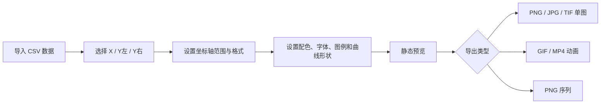

# LineAnimationApp

LineAnimationApp 是一个基于 MATLAB App Designer 风格代码实现的曲线动画绘图工具，面向科研数据、实验曲线、流变曲线和多列 CSV 数据的快速可视化。它支持静态预览、动画播放、双 y 轴绘图、科研配色、字体与图例样式控制，并可导出 GIF、MP4、PNG 序列以及常见静态图片格式。

> 当前仓库发布的是源代码版本，不包含已打包的 exe、安装器、MATLAB Compiler 中间文件或本地缓存文件。

## 功能概览

- CSV 数据导入：从表格中勾选一个 X 列，并分别选择左 y 轴和右 y 轴曲线。
- 双 y 轴绘图：基于 MATLAB `yyaxis` 实现，左右 y 轴标题、范围、格式、字号、字体和颜色可分别控制。
- 动画绘制：支持初始化动画、逐帧绘制曲线、静态预览和实时样式调整。
- 多格式导出：支持 GIF 动图、MP4 视频、PNG 序列、PNG/JPG/TIF 单图。
- 科研配色：内置 `Nature/NPG`、`Lancet`、`AAAS`、`NEJM`、`JAMA`、`Okabe-Ito`、`Tableau`、ColorBrewer 和 MATLAB 常用 colormap。
- 字体管理：自动读取系统字体，并提供常用中文和英文字体候选。
- 图例控制：支持图例位置、列数、白底、边框、字号、字体加粗和曲线/图例形状。
- 曲线标记：支持仅线、仅点、线+圆点、方块、菱形、三角形、五角星、十字和加号等样式，并自动稀疏显示标记以避免图形过密。
- 坐标格式：支持常规整数、常规小数、科学计数和 Log 坐标，并可设置小数位和刻度间隔。
- 设置持久化：样式设置、导出设置、图例设置会在下次打开时恢复；坐标范围会根据当前数据自动适配。
- 异常日志：关键回调带有异常捕获，便于定位打包后运行问题。

## 软件界面说明

界面分为三个主要区域：

| 区域 | 作用 |
| --- | --- |
| 左侧数据区 | 查找/替换曲线名称，选择 X、Y左、Y右 数据列 |
| 中间控制区 | 数据导入、导出参数、预览/动画/导出按钮、坐标轴范围、全局样式和轴级样式 |
| 右侧绘图区 | WYSIWYG 预览图、坐标轴标题、图例位置和常用显示开关 |



## 快速开始

1. 打开 MATLAB。
2. 将当前目录切换到本仓库所在文件夹。
3. 在命令行运行：

```matlab
LineAnimationApp
```

4. 点击 `选择数据文件` 导入 CSV。
5. 在左侧表格中勾选一个 X 列，并勾选需要绘制的 `Y左` 或 `Y右` 曲线。
6. 点击 `静态预览` 检查图形效果，或点击 `绘制动图` 查看动画。
7. 设置导出宽高、DPI、动画间隔和格式后，点击 `导出选定格式`。

## 数据格式建议

推荐使用第一行为变量名的 CSV 文件，例如：

```csv
Time,height-0mm,height-5mm,height-10mm,RightAxisData
0,0.1,0.2,0.3,10
1,0.5,0.7,0.9,15
2,1.2,1.5,1.8,22
```

使用建议：

- X 列通常选择时间、位移、剪切速率等自变量。
- 左 y 轴适合放同量纲的主要曲线。
- 右 y 轴适合放不同量纲或不同数量级的数据。
- 曲线较多时，可增加图例列数，或选择仅线样式提升可读性。

## 导出说明

| 格式 | 用途 |
| --- | --- |
| PNG 单图 | 论文、报告、PPT 中常用的高质量静态图 |
| JPG 单图 | 文件体积较小的预览图或分享图 |
| TIF 单图 | 适合部分期刊或高分辨率图像归档 |
| GIF 动图 | 适合快速展示曲线生成过程 |
| MP4 视频 | 适合汇报、演示和视频剪辑 |
| PNG 序列 | 适合后续在 Premiere、After Effects 等软件中合成 |

导出前建议先执行一次 `静态预览`，确认坐标范围、图例位置、字体、颜色和双 y 轴显示符合预期。

## 打包为 exe

如果需要打包为 Windows exe，可使用 MATLAB Application Compiler：

1. 确认 MATLAB Compiler 已安装。
2. 将 `LineAnimationApp.m` 设置为主文件。
3. 根据需要设置应用名称、图标、作者信息和安装路径。
4. 打包后建议先在 MATLAB 内运行源码版本确认功能正常，再测试 exe。

本仓库不提交打包后的 exe、installer、`for_testing`、`for_redistribution` 等产物，以保持源码仓库简洁。

## 环境要求

- MATLAB R2024a 或较新版本优先。
- 建议安装 MATLAB Compiler，用于后续打包 exe。
- 运行源码不依赖外部第三方包。

## 项目结构

```text
.
├── LineAnimationApp.m   # 主程序，包含 UI、绘图、动画、导出和设置持久化逻辑
├── README.md            # 项目说明
├── LICENSE              # 开源许可证
└── .gitignore           # 忽略打包产物和本地临时文件
```

## 作者

- Author: ZYY
- Email: zhangyiye1860@163.com

## License

This project is released under the MIT License.
